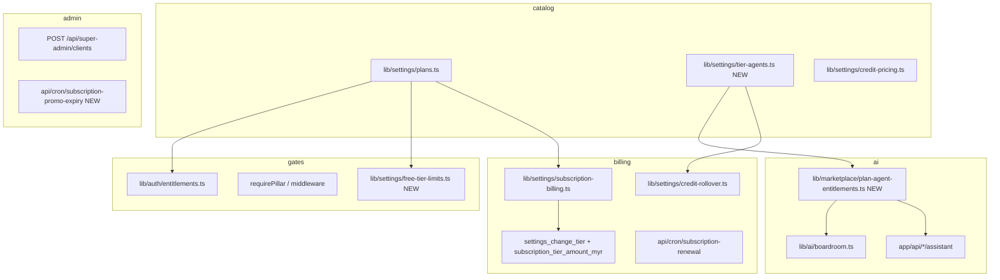

# Pricing Plan — Implementation Plan

> **Status:** Draft v1 · ready to execute  
> **Owner:** Platform / billing (cross-cutting)  
> **Spec:** [`docs/pricing-plan.md`](../pricing-plan.md) (approved direction)  
> **Forecast:** [`docs/pricing-forecast-y1.md`](../pricing-forecast-y1.md)

This plan turns the approved pricing model into code: **Free (200 MB)**, **Basic RM39** (3 modules + 3 agents), **Solo+ RM79/169/299** (6 modules + 6 agents), **scaled add-ons**, **free-tier caps**, **plan-included AI**, **COGS-guarded email**, and **super-admin client provisioning with promo tiers**.

**Current code reality:** `lib/settings/plans.ts` still lists **RM69/139/249**, module-gated tiers, **5 GB Free**, agents as **RM20/mo add-ons**, `MONTHLY_CREDITS_PER_AGENT = 100`, `loadActiveAiAgentSlugs()` reads **`business_addons`** only.

---

## 1. Goals & non-goals

### 1.1 Goals

1. **Catalog truth** — `plans.ts`, billing RPCs, and UI show **Free / Basic / Solo / Micro / Small** prices and quotas from the spec.
2. **Entitlements** — pillar gates and agent access match tier (3 modules + 3 agents on Basic; 6 + 6 on Solo+).
3. **Free enforcement** — Finance lite caps (25 invoices/mo, 50 customers, no expenses, no DuitNow, **200 MB**).
4. **Plan-included AI** — credits granted on subscribe/renewal from **tier**, not marketplace agent subscription.
5. **Marketplace** — scaled add-on prices; hide per-agent monthly SKU for paid tiers; core items (holidays, DuitNow, templates) no longer require add-on purchase on Solo+.
6. **Super-admin** — create client account + optional **N months free** promo tier (e.g. Solo 3 months).
7. **Tests** — entitlements, billing amounts, free caps, Basic deep-mode block, promo expiry.

### 1.2 Non-goals (defer or phase 2)

- Full **COGS guardrail** automation (email throttle at 15%/20% MRR) — scaffold `business_usage_monthly` in Phase 5; ship counters first.
- **Scale RM429** tier (`scale` `TierKey`) — optional; use `enterprise` quotas as Small until `scale` exists.
- **Grandfathering** RM69/139/249 — product decision (§13 pricing-plan); implement flag `legacy_pricing_until` if needed.
- **SST display** on marketing site — copy only unless billing already handles SST lines.
- Migrating all storage to R2 — quotas still use `plans.ts` + `storage-quota.ts`.

---

## 2. Architecture overview

**Key design choice:** Introduce `lib/settings/tier-agents.ts` as the single map of:

- `TierKey` → included pillar list (may diverge from cumulative `TIER_PILLARS` for Basic).
- `TierKey` → included agent addon slugs (`admin-assistant`, `sales-assistant`, `finance-assistant` on Basic).
- `TierKey` → monthly bundled credits (60 / 120 / 180 / 360 / 600).
- `TierKey` → `allowDeepReasoning: boolean` (false on Basic).

`hasActiveAddon(slug)` for **agent slugs** becomes: **plan-included OR active `business_addons` row** (legacy grandfather).

---

## 3. Data model changes

### 3.1 Migration `YYYYMMDD_pricing_plan_tiers.sql`

| Change | Detail |
|--------|--------|
| `businesses.tier` check | Add `'basic'` → `('starter', 'basic', 'micro', 'sme', 'enterprise')` |
| `subscription_tier_amount_myr()` | `basic` → **39**, `micro` → **79**, `sme` → **169**, `enterprise` → **299** |
| `settings_change_tier()` | Accept `basic`; audit `subscription.tier_change` |
| `subscription_promotions` **new table** | `business_id`, `promo_tier`, `post_promo_tier`, `started_at`, `ends_at`, `campaign_code`, `granted_by`, `notes` |
| `business_usage_monthly` **new table** (Phase 5 scaffold) | `business_id`, `month`, `emails_sent`, `email_cogs_myr`, `ai_cogs_myr`, `plan_mrr_myr`, `guardrail_status` |
| `businesses` optional columns | `free_invoices_this_month`, `free_emails_this_month` **or** derive from `audit_log` / counter table |

### 3.2 Marketplace seed migration

Update `marketplace_addons.price_cents` to scaled prices (§9 pricing-plan). Mark agent assistant rows:

- `billing_mode = 'plan_included'` (new enum or `metadata.plan_included = true`) so UI hides monthly purchase on paid tiers.
- Top-up SKUs: 100 → **1000 cents**, 300 → **2800**, 500 → **4500**.

### 3.3 Tier quota reference (implementation)

| TierKey | Label | RM/mo | Storage | Customers | Seats | Agents | Credits/mo | Deep mode |
|---------|-------|-------|---------|-----------|-------|--------|------------|-----------|
| `starter` | Free | 0 | **200 MB** | 50 saved | 1 | 0 | 0 | — |
| `basic` | Basic | 39 | **1 GB** | 200 | 1 | 3 | 60 | **no** |
| `micro` | Solo | 79 | 5 GB | 500 | 1 | 6 | 120 | yes |
| `sme` | Micro | 169 | 15 GB | 2,000 | 5 | 6 | 180 | yes |
| `enterprise` | Small | 299 | 40 GB | 10,000 | 12 | 6 | 360 | yes |

Storage: store **MB** for Free/Basic in `plans.ts` (`storageMb`) or use fractional GB (`0.2`, `1`) — pick one and use consistently in `storage-quota.ts`.

---

## 4. Phase breakdown

### Phase 0 — Prep (0.5 day)

**Do first — unblocks everything.**

| Task | Files |
|------|-------|
| Add implementation plan link in `pricing-plan.md` | `docs/pricing-plan.md` |
| Create `tier-agents.ts` with tier maps (no runtime switch yet) | `lib/settings/tier-agents.ts` |
| Extend `TierKey` type + tests for new union | `lib/settings/plans.ts`, `tests/settings/` |
| Document open decision defaults in plan | this file §8 |

**Definition of done:** `tierBy('basic')` compiles; unit tests for tier credit grants.

---

### Phase 1 — Catalog & billing amounts (1–2 days)

| Task | Files / notes |
|------|----------------|
| Rewrite `TIERS` + `ADDONS` in plans catalog | `lib/settings/plans.ts` |
| Labels: Free, Basic, Solo, Micro, Small | retire Starter/Growth/Pro in UI |
| `tierAmountMyr()` + annual amounts | `lib/settings/subscription-billing.ts` |
| SQL `subscription_tier_amount_myr` + tier check | new migration |
| Super-admin plans load | `lib/super-admin/plans-load.ts`, `app/(super-admin)/super-admin/plans/` |
| Subscription compare UI | `components/settings/SubscriptionView.tsx` |
| Tests | `tests/settings/subscription-billing.test.ts` |

**Definition of done:** Compare table shows RM39/79/169/299; `tierAmountMyr('basic') === 39`; DB RPC matches TS.

---

### Phase 2 — Entitlements & navigation (1–2 days)

| Task | Files / notes |
|------|----------------|
| `TIER_PILLARS` + `basic` pillar set | `lib/auth/entitlements.ts` |
| Solo+ = all six pillars on `micro`, `sme`, `enterprise` | breaks cumulative partial unlock |
| `minimumTierFor()` order: `starter` → `basic` → `micro` → … | upgrade CTAs (“Upgrade to Basic”) |
| Sidebar / home tiles / `requirePillar` | `components/shells/desktop-shell.tsx`, `app/(app)/layout.tsx` |
| Boardroom gate: block `basic` | `lib/ai/boardroom.ts`, boardroom pages |
| Sign-up default tier | keep `starter` free path; paid path offer Basic | `app/api/auth/sign-up/route.ts` |
| Zod enums for tier | `app/api/super-admin/businesses/[id]/route.ts`, settings APIs |

**Definition of done:** Basic tenant sees Admin + Sales + Finance only; Operations URL → upgrade modal.

---

### Phase 3 — Free tier enforcement (2–3 days)

| Task | Files / notes |
|------|----------------|
| Block expense UI + APIs for `starter` | finance routes, `app/(app)/finance/expenses/` |
| Invoice counter 25/mo | `lib/settings/free-tier-limits.ts` + RPC or `business_monthly_usage` |
| Email send counter 25/mo shared pool | invoice send + marketing send on Free |
| Block quotes, ledger, export | finance pages + API guards |
| Block static DuitNow toggle | invoice settings / PDF template |
| 50 saved customers cap | customer create API |
| Storage **200 MB** cap | `lib/admin/storage-quota.ts`, upload guards |
| Upgrade modals with tier CTA | shared `UpgradeModal` component |

**Definition of done:** Integration test: Free business cannot create expense; 26th invoice returns 403 + upgrade payload.

---

### Phase 4 — Basic tier (2–3 days)

| Task | Files / notes |
|------|----------------|
| Plan-included agents: Amir, Sufi, Fayza | `lib/settings/tier-agents.ts` |
| `planIncludesAgent(tier, slug)` | `lib/marketplace/plan-agent-entitlements.ts` |
| Replace `hasXAssistantAddon` checks in assistant routes | `lib/ai/staff-assistant-route.ts`, `app/api/*/assistant/route.ts` |
| Deep mode: reject `reasoning_mode = deep` on Basic | assistant routes + settings API |
| Force model `ilmu-mini-v3.3` on Basic | ignore deep model mapping |
| Credit grant **60** on Basic subscribe/renewal | subscription change + renewal cron |
| Boardroom disabled | UI + API |
| Storage **1 GB** | `storage-quota.ts` |

**Definition of done:** Basic tenant chats with Sufi without marketplace purchase; deep mode request returns 403.

---

### Phase 5 — Solo+ plan-included AI (2–3 days)

| Task | Files / notes |
|------|----------------|
| All six agents on `micro`, `sme`, `enterprise` via plan | `plan-agent-entitlements.ts` |
| `loadActiveAiAgentSlugs` = plan agents ∪ legacy addons | `lib/ai/boardroom.ts` |
| Credit grants: 120 / 180 / 360 per tier | `tier-agents.ts`, renewal cron |
| Remove/hide agent purchase in marketplace for entitled tiers | `components/marketplace/`, `BundleCard.tsx` |
| `MONTHLY_CREDITS_PER_AGENT` → tier total grant helper | `lib/settings/credit-pricing.ts` |
| `credit-rollover.ts` uses tier grant not 100×count | `lib/settings/credit-rollover.ts` |
| HR public holidays: entitlement from HR pillar on Solo+ | remove addon gate for `hr-public-holidays` |
| Static DuitNow on paid without addon | finance invoice template |

**Definition of done:** New Solo subscriber gets 120 credits and 6 agents without `business_addons` rows.

---

### Phase 6 — Marketplace add-on prices (1 day)

| Task | Files / notes |
|------|----------------|
| Migration: update `price_cents` on addon rows | §9 scaled prices |
| `ADDONS` constant in plans.ts | marketing site / subscription page |
| Add-on ceiling validation (50% plan MRR) | marketplace activate API |
| Free cannot buy (existing) | verify `tier === starter` |

**Definition of done:** Recurring invoices addon shows RM9/mo; activate invoice proration uses new cents.

---

### Phase 7 — Super-admin create client + promos (3–4 days)

| Task | Files / notes |
|------|----------------|
| UI `super-admin/clients/create` | `app/(super-admin)/super-admin/clients/create/page.tsx` |
| `POST /api/super-admin/clients` | create business, user invite, set tier |
| Promo fields: `promo: { tier, months }`, `postPromoTier`, `campaignCode` | |
| Insert `subscription_promotions` + set effective tier | |
| Grant credits immediately for promo tier | reuse subscription activate helper |
| Audit `super_admin_audit` | extend action type `client.provision` |
| Cron `subscription-promo-expiry` | downgrade / bill / 7-day grace |
| Extend `super-admin.md` | `docs/architecture/super-admin.md` |

**Definition of done:** Admin creates business with Solo 3-month promo; owner gets 120 credits; audit row exists.

---

### Phase 8 — Metering scaffold (2 days, can parallel Phase 7)

| Task | Files / notes |
|------|----------------|
| `business_usage_monthly` table | migration |
| Increment `emails_sent` on Resend send paths | mailer helper |
| Persist `ai_usage` provider cost on every LLM call | audit existing coverage |
| Admin report stub | super-admin investor metrics |
| COGS guardrail: **warn only** v1 | log when email COGS &gt; 15% MRR |

Full broadcast throttle → Phase 8b after real usage data.

---

### Phase 9 — QA, migration, launch (2 days)

| Task | Detail |
|------|--------|
| Update demo seed tiers | `scripts/reset-and-seed-demo.ts` |
| Type-check + `npm run build` | |
| E2E smoke: Free → Basic upgrade → Solo upgrade | |
| Super-admin regression | impersonate, tier patch |
| Changelog | `docs/CHANGELOG.md` |

---

## 5. File touch list (primary)

| Area | Files |
|------|-------|
| Catalog | `lib/settings/plans.ts`, `lib/settings/tier-agents.ts`, `lib/settings/credit-pricing.ts` |
| Entitlements | `lib/auth/entitlements.ts`, `lib/marketplace/plan-agent-entitlements.ts` |
| Free limits | `lib/settings/free-tier-limits.ts` (new) |
| AI | `lib/ai/boardroom.ts`, `lib/ai/boardroom-shared.ts`, `lib/settings/credit-rollover.ts`, `app/api/cron/*-assistant-renewal` |
| Assistant APIs | `app/api/admin/assistant/route.ts`, `finance`, `sales`, `operations`, `hr`, `marketing` |
| Billing | `lib/settings/subscription-billing.ts`, `app/api/settings/subscription/change/route.ts`, `app/api/cron/subscription-renewal/route.ts` |
| Storage | `lib/admin/storage-quota.ts`, `lib/admin/overview.ts` |
| Marketplace UI | `components/marketplace/*`, `components/settings/SubscriptionView.tsx` |
| Super-admin | `app/api/super-admin/clients/route.ts` (new), `app/(super-admin)/super-admin/clients/` |
| DB | new migration(s), `supabase/migrations/` |
| Tests | `tests/settings/subscription-billing.test.ts`, `tests/auth/entitlements.test.ts` (new), `tests/settings/free-tier-limits.test.ts` (new) |

---

## 6. Suggested sprint order

| Sprint | Phases | Outcome |
|--------|--------|---------|
| **S1** | 0 + 1 + 2 | Correct prices in UI; pillar gates for Basic vs Solo+ |
| **S2** | 3 + 4 | Free caps live; Basic RM39 shippable |
| **S3** | 5 + 6 | Solo+ agents included; cheap add-ons |
| **S4** | 7 + 8 + 9 | Campaign provisioning; usage scaffold; launch |

**Minimum viable pricing launch:** S1 + S2 + S3 (super-admin promos can follow within 1 week if campaigns not immediate).

---

## 7. Testing matrix

| Case | Expected |
|------|----------|
| Free: 25 invoices OK, 26th blocked | 403 + upgrade CTA |
| Free: expense create | 403 |
| Free: storage &gt; 200 MB | upload blocked |
| Basic: ops module URL | upgrade to Solo |
| Basic: Sufi chat | works without addon row |
| Basic: deep reasoning | 403 |
| Solo: 6 agents, 120 credits on subscribe | balance += 120 (bundle) |
| Solo: Maya without addon | works |
| Marketplace: agent SKU hidden on Solo | UI |
| Addon RM9 recurring invoices | correct proration |
| Super-admin: Solo 3mo promo | tier effective, credits 120, ends_at set |
| Promo expiry cron | downgrade or bill |

---

## 8. Open decisions (defaults for implementation)

| # | Decision | **Default if not overridden** |
|---|----------|-------------------------------|
| 1 | Grandfather RM69/139/249 | **No** — migrate existing paid to new prices at renewal |
| 2 | Paid invoice fair-use cap | **Soft 500/mo on Solo** with monitor; Basic 200/mo |
| 3 | Mid-month upgrade credit grant | **Full grant** on upgrade tier |
| 4 | Post-promo billing | **Card optional at provision**; email at promo end |
| 5 | `scale` tier | **Defer** — Small covers &gt;12 seats via seat add-ons |
| 6 | SST on marketing prices | **Excl. SST** in copy |

---

## 9. Risks

| Risk | Mitigation |
|------|------------|
| Agent entitlement regression | `planIncludesAgent` wrapper; keep legacy addon rows honored |
| Credit double-grant on upgrade | single `subscription.credits_granted` audit per period |
| Free counter bypass via API | enforce in RPC, not UI only |
| Promo abuse | super-admin only; audit + campaign_code required |
| Basic RM39 margin | Mini-only + 60 credits; monitor `ai_usage` weekly |
| Partial deploy (prices without gates) | ship S1 before enabling Basic in self-serve checkout |

---

## 10. Document history

| Date | Change |
|------|--------|
| 2026-08-07 | Initial implementation plan from approved `pricing-plan.md` |

**Related:** [`pricing-plan.md`](../pricing-plan.md), [`pricing-forecast-y1.md`](../pricing-forecast-y1.md), [`architecture/super-admin.md`](../architecture/super-admin.md), [`marketplace-addons.md`](../marketplace-addons.md).
